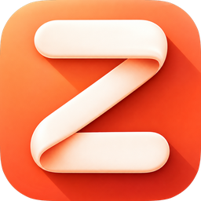
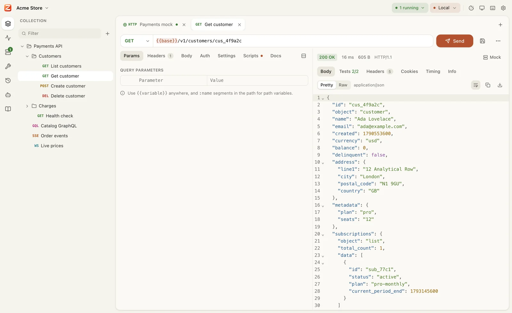
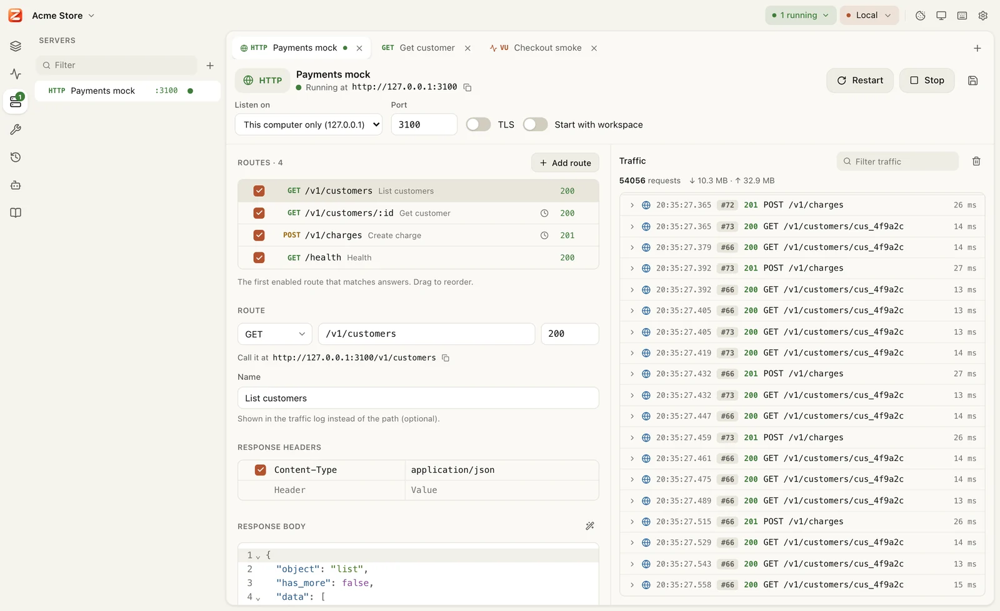
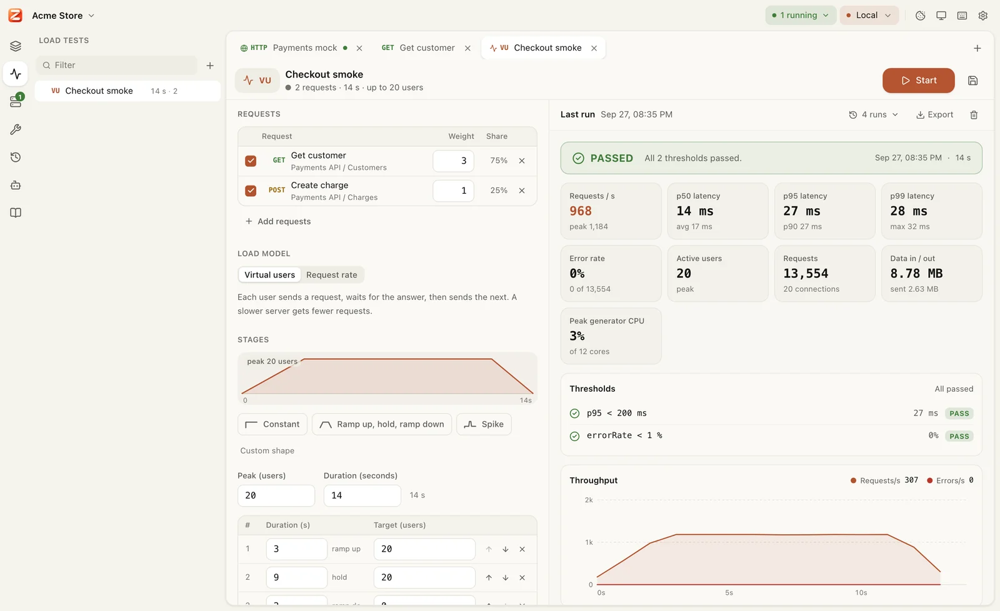
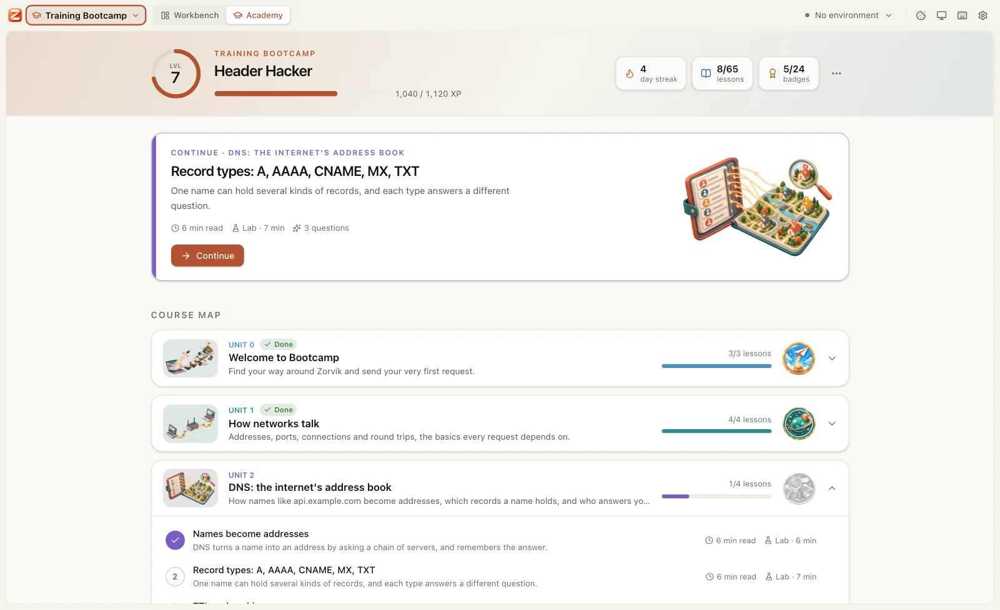

<p align="center">
  
</p>

<h1 align="center">Zorvik</h1>

<p align="center">
  <b>One workbench for every wire.</b><br>
  Build, test, mock and load test APIs, and see what really happens on the network.<br>
  An open-source desktop app for Windows, macOS and Linux that your coding agent can drive.<br>
  <b>Every feature free.</b> No paid plans, no account, no cloud sync.
</p>

<p align="center">
  <a href="https://github.com/LibreGuild/zorvik/releases/latest"></a>
  <a href="https://github.com/LibreGuild/zorvik/actions/workflows/ci.yml"></a>
  <a href="#license"></a>
  
</p>

<p align="center">
  <a href="https://github.com/LibreGuild/zorvik/releases/latest"><b>Download</b></a> ·
  <a href="https://libreguild.github.io/zorvik/">Website</a> ·
  <a href="https://libreguild.github.io/zorvik/docs/">Docs</a> ·
  <a href="#features">Features</a> ·
  <a href="#command-line">Command line</a> ·
  <a href="#ai-agents">AI agents</a> ·
  <a href="CONTRIBUTING.md">Contributing</a>
</p>

<picture>
  <source media="(prefers-color-scheme: dark)" srcset=".github/assets/request-dark.webp">
  
</picture>

## Why Zorvik
- **Your coding agent can drive it.** Claude Code, Codex, Gemini CLI, Cursor and any MCP client use Zorvik's 37 built-in tools to turn the APIs in your code into requests, test them, mock them and load test them, while you watch every step and approve anything risky. [More below](#ai-agents).
- **Every feature is free, for good.** No paid plans, no "team" tier, no feature behind a login, and none planned. Open source under MIT or Apache-2.0.
- **Everything in one place.** HTTP, GraphQL, gRPC, WebSocket, SSE, TCP, UDP, MQTT and DNS clients; mock servers; load tests; network tools. One app instead of five.
- **Your API work is plain files.** A workspace is a folder of readable YAML. Commit it to Git, review it in pull requests, share it with your team. Secrets stay on your computer.
- **Honest numbers.** Every request shows where its time went (DNS, connect, TLS, first byte, download), which certificate answered and the headers that really left your machine. Load tests measure latency without hiding a slow server's queue.
- **Local first.** No account, no cloud sync, no tracking, and none planned. It works offline and behind corporate proxies and TLS inspection. The only thing it connects to by itself is GitHub, to check for updates, and it sends nothing about you.
- **Scriptable and automatable.** Postman-compatible scripts and tests, a collection runner with data files, and the `zorvik` command line for CI.
- **Learn it inside the app.** The Training Bootcamp teaches networks and APIs from zero, with hands-on labs in the real workbench.

<p align="center">
  
</p>

## AI agents
**Zorvik is built to be driven by coding agents.** Its MCP server ships in every install, so Claude Code, Codex, Gemini CLI, Cursor or any MCP client can work with your APIs the way you do in the app:
- **Map your code to a collection:** the agent reads your routes and saves them as requests, with path and query parameters, bodies and auth.
- **Send and test:** it sends requests (HTTP, GraphQL, gRPC, DNS, event streams), writes tests, runs folders and collections, and reads the results and history.
- **Mock and serve:** it builds mock APIs and servers, starts them and reads the traffic they received.
- **Load test:** it plans and runs load tests and reads the latency and errors.
- **Hand you code:** it exports requests as cURL, Kotlin, Swift, JavaScript or Python.

You see every action in the app as it happens. Deleting, load testing, starting servers and sending requests to hosts outside your computer ask you first, and secrets are masked in everything the agent sees.

Connect your agent once (Settings → AI agents shows these with the right path for your computer):

```bash
claude mcp add --scope user zorvik -- zorvik mcp       # Claude Code
codex mcp add zorvik -- zorvik mcp                     # Codex
gemini mcp add --scope user zorvik zorvik mcp          # Gemini CLI
```
For Cursor, Windsurf, VS Code and other MCP clients, add this to their MCP settings:
```json
{ "mcpServers": { "zorvik": { "command": "zorvik", "args": ["mcp"] } } }
```
Then ask things like *"map the API routes in this repo to a Zorvik collection"* or *"run the Users folder in Zorvik and fix the failing tests"*.

## Features

### Build and send
- **HTTP/1.1, HTTP/2 and HTTP/3** with a timing waterfall, TLS certificate details, redirects, cookies and the exact headers sent.
- **Bodies of every kind:** JSON, text, XML, forms, multipart, binary files and GraphQL, with syntax highlighting, search and pretty printing.
- **GraphQL:** schema from introspection, autocomplete, a schema explorer and variables.
- **gRPC:** server reflection or `.proto` files; unary, server, client and bidirectional streaming; metadata; TLS.
- **Realtime and sockets:** WebSocket, Server-Sent Events, TCP, UDP, MQTT 3.1.1 and 5, and DNS queries over UDP, TCP, TLS or HTTPS.
- **Responses you can dig into:** filter with JSONPath, jq or XPath, and save responses as examples that document the request and feed your mocks.
- **Environments and variables:** Local, Staging, Production; secret values that never enter the workspace files; 170 dynamic values (every one of Postman's and more: `{{$randomFullName}}`, `{{$randomInt(1, 100)}}`, `{{$isoDate(+3d)}}`, valid test card numbers and IBANs); auth and headers inherited from folders.
- **Auth:** Basic, Bearer, API keys, OAuth 2.0 (client credentials, password, authorization code with PKCE, implicit, refresh) and OAuth 1.0; JWT, AWS Signature v4, Hawk, Akamai EdgeGrid and Atlassian ASAP signed fresh for every send; Digest and NTLM.
- **Corporate networks:** system or manual proxy, the OS certificate store, custom CAs and client certificates (mTLS).
- **History** of everything you sent, searchable, with secrets hidden.

### Test and automate
- **Scripts:** pre-request and post-response JavaScript with a Postman-compatible `pm` API, so imported collections run as they are: `pm.sendRequest`, cookies, timers, the visualizer, and Postman's libraries built in (lodash, crypto-js, moment, ajv, chai and more), all offline.
- **Tests:** `pm.test`, `pm.expect` and JSON Schema checks, with results next to the response.
- **Collection runner:** run a folder in order, repeat it, drive it with CSV or JSON data, stop on the first failure, export JSON or JUnit reports.
- **Polling and streams in runs:** send a request again until a condition holds (wait for a job to finish), and test Server-Sent Events streams (`pm.response.events`).
- **Contract checks:** requests imported from an OpenAPI document are checked against it on every send and run: an undocumented status or a field of the wrong type fails a test.
- **CI:** `zorvik run` runs the same collections in any pipeline.

### Mock and serve
- **Mock APIs** from scratch, from a folder of requests (answering with their saved examples), from an OpenAPI spec, or from a response you just received. Routes with `:params`, templated bodies, delays, fault injection, CORS, and forwarding to a real backend.
- **Servers:** WebSocket, SSE, TCP, UDP and DNS servers, plus a TCP relay that shows both directions. Every server logs its traffic live.
- **Headless:** `zorvik serve` runs any of them in CI next to your tests.
- **Busy port?** The error names the program holding it.

<picture>
  <source media="(prefers-color-scheme: dark)" srcset=".github/assets/mock-dark.webp">
  
</picture>

### Load test
- **Virtual users or arrival rate,** with stages (ramp up, hold, spike), weighted requests and think time.
- **Live dashboard:** requests per second, latency percentiles up to p99.9, errors, status codes and the load generator's own CPU.
- **Thresholds** such as "p95 under 200 ms" pass or fail a run; run history and HTML/JSON reports.
- **Realistic traffic:** a data file gives each virtual user its own row, and captures pass values from one response (a new order's id) to that user's next requests.
- **Where the time goes:** time to first byte, transfer and connect per request, the server's own time from `Server-Timing`, and a side-by-side comparison with an earlier run.
- **In CI:** `zorvik load` exits with an error when a threshold fails.

<picture>
  <source media="(prefers-color-scheme: dark)" srcset=".github/assets/loadtest-dark.webp">
  
</picture>

### Learn: the Training Bootcamp
- **A course built in,** from "what is a network?" to load testing: 16 units on networks, DNS, HTTP, sending data, auth and JWT, TLS, environments, testing, GraphQL and gRPC, WebSocket and SSE, TCP and UDP, mocking, performance and automation, plus a capstone project.
- **Hands-on labs** in the real workbench: **Start lab** runs practice servers on your computer and fills in a Lab environment, and the **Lab Guide** ticks each step off the moment you get it right. Hints go from a nudge to the exact clicks.
- **Plain words and diagrams:** short readings with sequence, flow and layer diagrams, and a quick check after each lesson.
- **Rewards:** XP, levels and ranks, daily streaks, 24 badges, and a *Zorvik Bootcamp Graduate* certificate. Open it from **Training Bootcamp**, pinned at the top of the workspace menu and on the welcome screen; inside it, a *Workbench | Academy* switch moves between the lessons and the labs. Its workspace is always there and resets in one click.

<picture>
  <source media="(prefers-color-scheme: dark)" srcset=".github/assets/academy-dark.webp">
  
</picture>

### Inspect the network
TLS inspector (chain, expiry, protocol versions, cipher suites), DNS lookup, port check, ping, network interfaces, HTTP/3 check, and encoders for Base64, URL, hex, JWT, hashes and timestamps.

### Work your way
- **Import** Postman collections and environments, OpenAPI 3 and Swagger 2 (realistic examples, path parameters as variables), and cURL commands. When the API changes, **update from the spec**: new operations come in, your edits stay.
- **Export** any request as cURL, or as Kotlin (OkHttp), Swift, JavaScript or Python code.
- **Built-in docs** for every feature (the book icon in the left rail), a command palette (<kbd>Ctrl</kbd>/<kbd>⌘</kbd> <kbd>K</kbd>) and keyboard shortcuts.
- **Updates itself** from GitHub Releases: it downloads in the background and installs when you quit, or tells you and waits (Settings → Updates). Stable or nightly channel.
- **Light and dark themes,** zoom (<kbd>Ctrl</kbd>/<kbd>⌘</kbd> <kbd>+</kbd> <kbd>−</kbd> <kbd>0</kbd>), and your choice of interface and code fonts.

## Download
Get the newest version from [**Releases**](https://github.com/LibreGuild/zorvik/releases/latest). Every download includes the app **and** the `zorvik` command line.

| System | File | |
|---|---|---|
| Windows 10/11 | `Zorvik-Windows-Setup-x64.exe` | Installs for your user, no admin rights needed; puts `zorvik` on PATH |
| Windows 10/11 | `Zorvik-Windows-Portable-x64.zip` | No install: unzip and run `zorvik-desktop.exe` |
| macOS 11+ (Apple silicon and Intel) | `Zorvik-macOS-universal.dmg` | Drag to Applications |
| Ubuntu 22.04+, Debian 12+ | `Zorvik-Linux-amd64.deb` | `sudo apt install ./Zorvik-Linux-amd64.deb` |
| Fedora, RHEL, openSUSE | `Zorvik-Linux-x86_64.rpm` | `sudo dnf install ./Zorvik-Linux-x86_64.rpm` |
| Any Linux (x86-64) | `Zorvik-Linux-x86_64.AppImage` | `chmod +x`, then run |

Want the newest changes before a release? The [nightly build](https://github.com/LibreGuild/zorvik/releases/tag/nightly) is made from `main` once a day when it changed; choose the nightly channel in Settings → Updates to follow it.

### Only the command line
For CI machines, servers and containers, each release also has the `zorvik` command on its own:

| System | File |
|---|---|
| Windows (x64) | `zorvik-cli-windows-x64.zip` |
| macOS (Apple silicon and Intel) | `zorvik-cli-macos-universal.tar.gz` |
| Linux (x86-64, glibc 2.35+) | `zorvik-cli-linux-x86_64.tar.gz` |

```bash
curl -fsSL https://github.com/LibreGuild/zorvik/releases/latest/download/zorvik-cli-linux-x86_64.tar.gz | tar -xz zorvik
./zorvik --version
```

### Updates
The installer on Windows, the app on macOS and the AppImage on Linux update themselves: Zorvik checks GitHub Releases, downloads the new version in the background, and installs it when you quit (or when you choose **Restart now**). It asks first if a restart would stop a server, a load test or unsaved work. The portable zip, `.deb` and `.rpm` tell you a new version is out and link to it. Settings → Updates switches between automatic, notify only and off, and between the stable and nightly channels.

The update check goes to GitHub only and sends nothing about you: no ID, no usage data, just the download request your computer makes to GitHub.

### First launch
The builds are not code-signed yet. On **Windows**, if SmartScreen appears, choose **More info → Run anyway**. On **macOS**, the first open is blocked: open System Settings → Privacy & Security → **Open Anyway**.

## Quick start
1. Open Zorvik and **create a workspace**: pick an empty folder, or one inside your project's Git repository.
2. Press <kbd>Ctrl</kbd>/<kbd>⌘</kbd> <kbd>N</kbd> for a new request, paste a URL and press <kbd>Ctrl</kbd>/<kbd>⌘</kbd> <kbd>Enter</kbd>.
3. Press <kbd>Ctrl</kbd>/<kbd>⌘</kbd> <kbd>S</kbd> to save it into your collection, and <kbd>Ctrl</kbd>/<kbd>⌘</kbd> <kbd>E</kbd> to add environments.

Already on Postman? Choose **Import…** and drop in your collection export. Scripts and tests come along.

## Command line
The `zorvik` command ships inside every install, and on its own for CI ([Only the command line](#only-the-command-line)). On macOS, Settings → AI agents → **Add zorvik to PATH** makes it available in your terminal.

```bash
zorvik run ./my-api --env Staging              # every request in the workspace, with scripts and tests
zorvik run ./my-api --folder Users -d users.csv --junit report.xml
zorvik load ./my-api "Checkout smoke" --html report.html   # exits with 1 if a threshold fails
zorvik serve ./my-api "Payments mock" --port 3100          # run a saved mock or server
zorvik mcp                                                 # the MCP server for AI agents
```
Secrets are not in workspace files; pass them with `--var token=$TOKEN`. Run `zorvik <command> --help` for every option.

## Your workspace
```
my-api/
  zorvik.yaml          # workspace name, variables, default auth and headers
  environments/        # Dev.yaml, Production.yaml, … (secret values stay on your computer)
  requests/            # one YAML file per request, folders as folders
  servers/             # mock APIs and servers
  loadtests/           # load test plans
```
Files are small and diff cleanly. History, cookies, tokens and secret values live in the app's data folder on each computer, never in the workspace. See [docs/architecture.md](docs/architecture.md#workspace-format) for the format.

## Build from source
```bash
git clone https://github.com/LibreGuild/zorvik.git
cd zorvik/app && npm ci
npm run tauri dev          # run the app
npm run package            # build installers for your system
```
You need Rust (stable) and Node.js 22+; [CONTRIBUTING.md](CONTRIBUTING.md) lists the system packages for each OS.

## Documentation
- **[Zorvik docs](https://libreguild.github.io/zorvik/docs/)**: every feature in detail, the scripting and command-line references, and the workspace file format.
- In the app: the **Docs** section covers every feature.
- [Architecture](docs/architecture.md): how the pieces fit together.
- [Training Bootcamp](docs/academy.md): how the Academy works, and how to write a lesson.
- [Testing](docs/testing.md): the test suites and how to run them.
- [CI and releases](docs/ci-release.md): how builds, releases and the website are made.

## Community
- Questions and ideas: [Discussions](https://github.com/LibreGuild/zorvik/discussions)
- Bugs and feature requests: [Issues](https://github.com/LibreGuild/zorvik/issues/new/choose)
- Security problems: report them privately, see [SECURITY.md](SECURITY.md)
- Contributions are welcome! Start with [CONTRIBUTING.md](CONTRIBUTING.md) and the [Code of Conduct](CODE_OF_CONDUCT.md).

## License
Zorvik is free and open source, and every feature stays free: there are no paid plans and none are planned. It is licensed under either of

- [Apache License, Version 2.0](LICENSE-APACHE)
- [MIT license](LICENSE-MIT)

at your option. Unless you explicitly state otherwise, any contribution you submit for inclusion in Zorvik, as defined in the Apache-2.0 license, is dual licensed as above, without any additional terms or conditions.

<p align="center"><sub>Made by <a href="https://github.com/LibreGuild">Libre Guild</a>.</sub></p>
